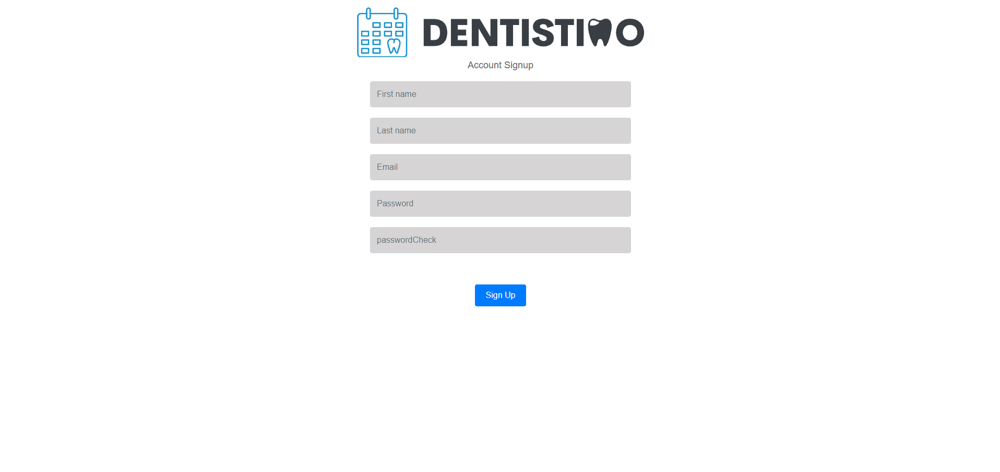
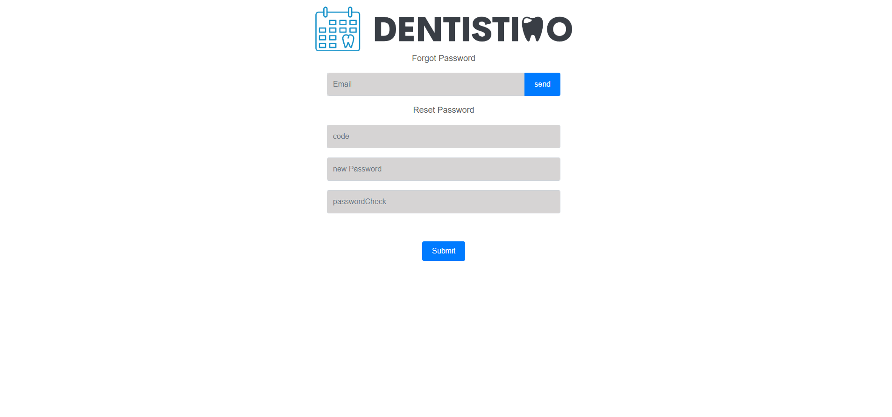
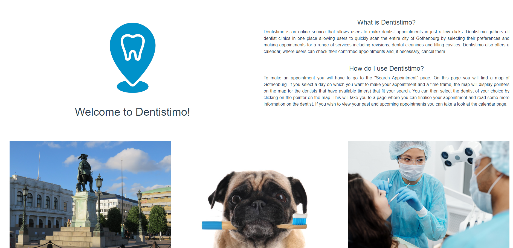
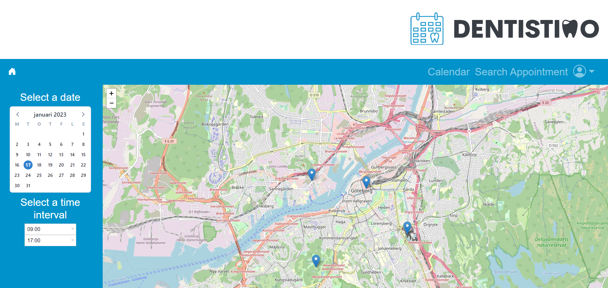
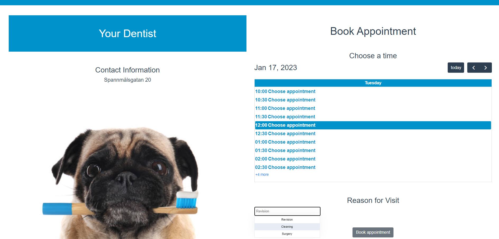
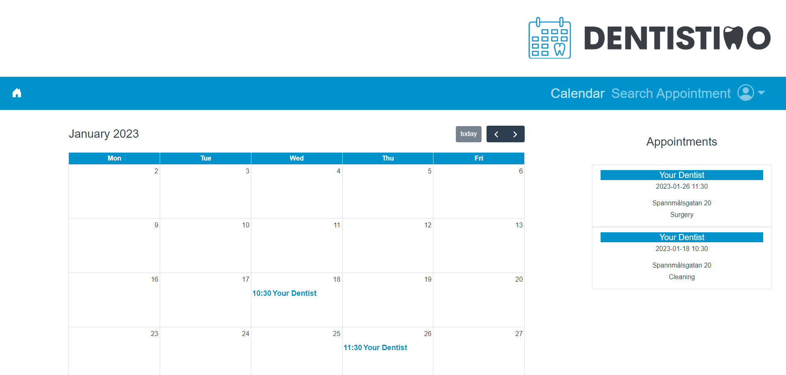
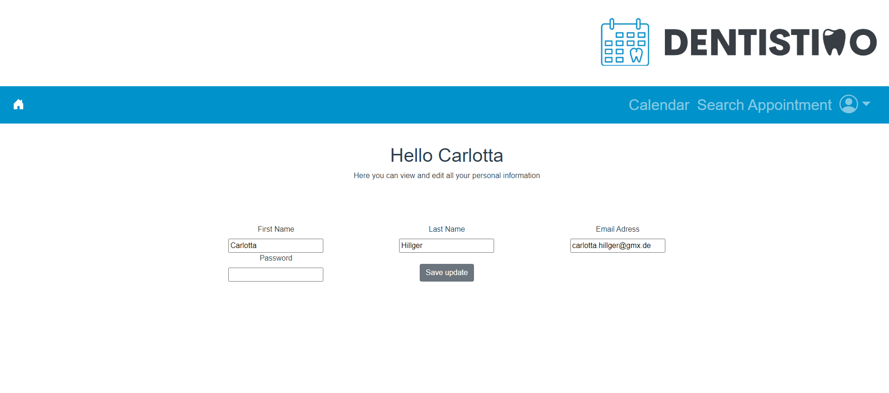

# User Client

The user client is the component the user directly interacts with. It includes the graphical user interface written with the vue 2 framework and allows the user to find and make appointments with the dentist of their choice.

  
## Visuals Diagram

The following diagram shows a prototype of the different pages and how they are connected to each other.

## Installation Instructions

To run the application you need to follow these steps:

- Clone the repository on your device
- Open a terminal and navigate to the folder "Client" with the command "cd client"
- In the terminal type "npm install", which installs all necessary dependencies
- Once that installation is complete type "npm run serve"
- Then open the displayed URL in a browser of your choice

## Usage

### Login
The login page allows the users to input their email and password to access the system, for those that are new to dentistimo, there is an option to register. If the user needs to, they can recover their password with their personal email, pressing "forgot password". 

### Registration
The registration page offers users the ability the ability to create an account, which is a requirement in order to use the system. All information is safely stored in a the backend component called "User Management", this information can be changed at any time by the users in the profile page. It displays various textfields that a user must complete in order to make an account.

### Forgot password
This page allows users who don't remember their password to send a code to their email associated to an account, which is then used as input to set a new password.

### Homepage
 The homepage offers users relevant information on the system, this information is divided into two sections:
 
- What is dentistimo? 
- How do I use dentistimo?
- 
### Search appointment
The search appointment page allows user to select an office of their choosing on a map. This screen is divided in two sections, the left of the screen offers the user the ability to select a specific date and time frame, these are set by default to the current date and the timeframe 9:00 -17:00. These values and any changes made to them dynamically display markers on the map that meet those filters. These are shown on the right side of the screen, comprised by a map of the city that allows users to visually understand the location of offices meeting their needs. Clicking a marker takes the user to the Confirm appointment / Dentist page

### Confirm appointment / Dentist page
This page displays information on the selected dentist office, as well as an agenda that displays the available timeslots of the office, the user is also given the ability to change the date if needed without having to go back to the "search appointment page". By selecting a time slot and a reason for visit, the user can click the "Book appointment" button to reserve the timeslot. If the request is succesful, the user is taken to the calendar page, where they can see all of their bookings.

### Calendar
The calendar page is made out of two components, on the left and centre, the user can see a calendar that displays appointments one moth at a time, the user may choose to display other months to see other appointments. The right side displays a list of all appointments, to make it easier to see those that don't show up on the calendar, these are shown in boxes that display the reason of visit and other relevant information. 

### User profile
The user profile allows the user to change their name, last name and email, in order for these changes to take effect, the user is also required to input their password and press the "Save changes" button.

## Architecture of the project
### This project has been developed with the following **ASRs**:
-   **Availability:** Given the fact that the system shall provide dentist appointment bookings for all citizens of Gothenburg.
    
-   **Simplicity:** Given the fact that the system will serve a single purpose, simplicity becomes important. This is also reflected in the architectural styles that have been chosen.
    
-   **Performance:** Given that this system will be used yearly by more than half a million users, it shall be able to handle thousands of concurrent users. This can be achieved using a "publish and subscribe" architecture as it provides light-weight messaging.
    
-   **Usability:** Given that the end goal is the release of a product for a large number of users with vastly different levels of technological literacy.
    
- **Reliability:** Given that the system will be under constant stress of large numbers of concurrent users, system is expected to work despite the possibility of individual components not working.

Given that this component is frontend, our focus was on **Simplicity** and **Usability**. Our pages are designed to be intuitive and require a minimal amount of steps to complete actions, to ensure this, we have made use of a dynamic map to visually indicate the location of the offices and Full-Calendar, to display in a clean and readable format the upcoming appointments for the user.

### Architectural styles:
This component has been made to comply with the following architectural styles:

- **Layered:** This component implements only frontend functionality and communicates with the different backend components to fetch the information it displays. It does not contain any business logic aside from that from the leaflet API.
-  **Publish-Subscribe**: This component uses MQTT for all communication with backend components, our solution is based on EMQX, an open source free server that allows us to try circuit breakers and other functionalities.
- **Pipeline**: This component allows the users to select some of the filters applied in the backend components, an example of this are the search functionalities, which allow users to find the offices that have available slots during times decided by the user.

### How to understand the architecture of the system
#### This Repository contains 4 different types of files:
- Those found in the client folder represent the code that makes up the Vue application: from the many files included in this folder, the ones containing the source code are in the **src folder**:

	- **App.vue:** main page on top of which all pages are displayed, code mostly works as a navigation bar and placeholder for global data.
	- **Main.js:** file that starts the application.
	- **Router.js:** file that specifies redirections of pages.
	- **Components:** folder that includes the header that the app uses.
	- **Views:** folder including all pages of the system.
	- **Assets:** folder containing images used in the different pages.
- **Gitlab CI:** script that ensures that the project builds.
- **Package-lock.json:** dependency tree used in the project.
- **IMG:** folder containing ReadMe images.

## Authors and acknowledgment Authors

### The code and documentation included in this repository was authored by:
- Juan Garcia Diaz - Scrum Master and Developer
- Carlotta Hillger - Developer

## License

This project is part of the course DIT356 for **Gothenburg university**.
Use is only allowed for the examiners or developers of this project.
