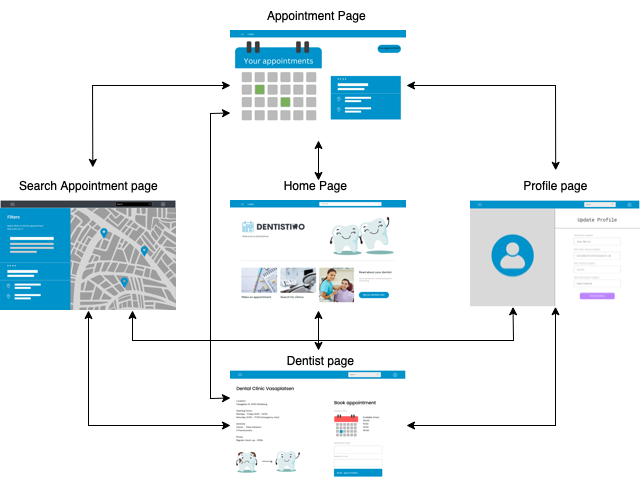

# User Client
The user client is the component the user directly interacts with. It includes the graphical user interface written with the vue (2 or 3?) framework and allows the user to find and make appointments with the dentist of their choice.

## Visuals Diagram 
The following diagram shows a prototype of the different pages and how they are connected to each other.

## Installation Instructions
To run the application you need to follow these steps:
 - Clone the repository on your device
 - Open a terminal and navigate to the folder "Client"
 - In the terminal type "npm install", which installs all necessary dependencies
 - Once that installation is complete type "rpm run serve"
 - Then open the displayed URL in a browser of your choice

## Usage 
TBD
## Authors and acknowledgment Authors 
TBD
## License 
TBD
